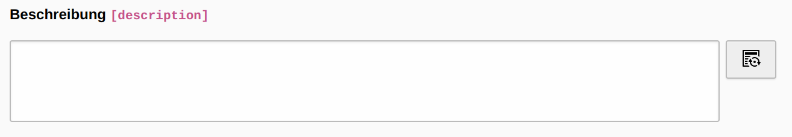
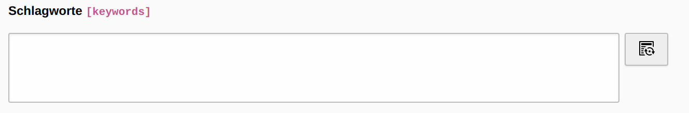
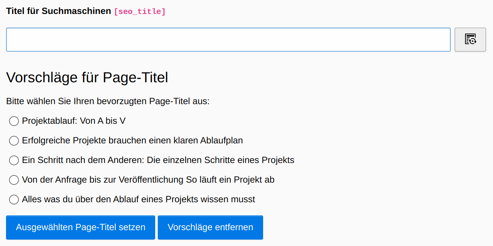

# TYPO3 Extension `AI SEO Helper`

Generates SEO metadata based on page content using AI. Currently, meta description, keywords and page title can be generated using an additional button next to the corresponding text fields.

## Installation

### Add via composer:

    composer require "passionweb/ai-seo-helper"

* Install the extension via composer
* Flush TYPO3 and PHP Cache
* Add your OpenAI secret key to the extension configuration before using the extension

### Add via TER:

If you want to install the extension via TER you can find detailed instructions [here](https://docs.typo3.org/m/typo3/guide-installation/10.4/en-us/ExtensionInstallation/Index.html).

* Install the extension via TER
* Flush TYPO3 and PHP Cache
* Add your OpenAI secret key to the extension configuration before using the extension

### Further information

The different ways to install an extension and additional detailed information can be found [here](https://docs.typo3.org/m/typo3/reference-coreapi/main/en-us/ExtensionArchitecture/HowTo/ExtensionManagement.html).

## Requirements

You need an OpenAI account and API key. If you have not yet created an account or key, you can do so using the following links.

Source: [Create OpenAI account](https://platform.openai.com/signup "Create OpenAI account")

Source: [Create API key](https://platform.openai.com/account/api-keys "Create API key")

## General information on data generation

The extension currently supports the [GPT-3.5 models](https://platform.openai.com/docs/models/gpt-3-5). Based on your individual requirements, different models can lead to different results (also in terms of quality). In addition, other parameters can be modified to further specify the OpenAI requests. You have the possibility to adjust the different models as well as the most of the supported request parameters ([detailed explanation can be found here](https://platform.openai.com/docs/api-reference/completions/create)) in the extension settings.

## Generate meta description

Added an additional button next to the meta description text field. When you click this button, the (text) content of the selected page is generated and a meta description that is as suitable as possible is created with the help of the AI. Currently, the page must not be deactivated in the backend. Depending on the page size, the process may take a few seconds. However, notifications are used to display appropriate information.

It can happen that the AI returns texts that exceed the maximum allowed length of the meta description. To additionally check the length of the meta description, the extension ["Yoast SEO for TYPO3"](https://extensions.typo3.org/extension/yoast_seo "Yoast SEO for TYPO3") can be used, for example, or various online tools.

## Generate keywords

Added an additional button next to the keywords text field. When you click this button, the (text) content of the selected page is generated and keywords that is as suitable as possible is created with the help of the AI. Currently, the page must not be deactivated in the backend. Depending on the page size, the process may take a few seconds. However, notifications are used to display appropriate information.

## Generate page title (suggestions)

Added an additional button next to the seo title text field. When you click this button, the (text) content of the selected page is generated, and you get page title suggestions with the help of the AI. By default, the extension prepares the page title suggestions in such a way that they can be selected via radio button. If you change the prompt prefix and no bullet point list is returned as a result, display problems can occur here. If you set the option `showRawPageTitleSuggestions` to true within the extension configuration you can output the raw content and select your favorite page title via copy/paste.

## Getting results in two different ways

Since version 0.3.0 you have two different options to generate the desired data. Both variants adds a ["language suffix"](#how-is-the-language-suffix-determined) to get the response in the language of the analyzed page/content.

### Analyzing the page content based on the text

If the content length does not exceed the maximum number of allowed characters (can be set in the extension settings with the option `maxAllowedCharacters`) and the maximum number of allowed OpenAi tokens (currently 4096 tokens per request), you can generate the desired data based on the page content in text form. If the page content exceeds the maximum allowed character length, the variant via URL is automatically used.

As already mentioned, this option is primarily limited by the length of the allowed characters per OpenAI request. Furthermore, using this method requires the use of a comparatively large number of tokens.

The following settings are necessary:

- disable the `useUrlForRequest` option in the extension settings (as already mentioned, will be ignored if content is too large)
- check if the ISO code(s) of the language configurations is/are present in the predefined fields (if not present, custom languages can be added, see ["Add custom languages"](#add-custom-languages)).
- Definition of the corresponding prompt in English.

The entire prompt is then assembled from the prompt prefix (from the extension settings), the page url and the language suffix (based on the language used on the page). An example of the generated prompt for page title suggestions would look like this (for a German language site):

    1. Suggest page title ideas in bullet point list for the following text (content from extension setting `openAiPromptPrefixPageTitle`)
    2. in German (language suffix based on the language used on the page)
    3. Here comes the page content

    Complete:

    Suggest page title ideas in bullet point list for the following text in German:

    Here comes the page content

### Analyzing the page content by URL

In contrast to the text-based variant, this option uses the URL of the page to analyze the desired data. If you want to use this variant, the following settings are necessary:

- enable the `useUrlForRequest` option in the extension settings
- check if the ISO code(s) of the language configurations is/are present in the predefined fields (if not present, custom languages can be added, see ["Add custom languages"](#add-custom-languages)).
- Definition of the corresponding prompt in English.

The entire prompt is then assembled from the prompt prefix (from the extension settings), the page url and the language suffix (based on the language used on the page). An example of the generated prompt for page title suggestions would look like this (for a German language site):

    1. Suggest page title ideas in bullet point list for (content from extension setting `openAiPromptPrefixPageTitle`)
    2. https://www.example.de/ (page url)
    3. in German (language suffix based on the language used on the page)

    Complete:

    Suggest page title ideas in bullet point list for https://www.example.de/ in German

Requirement is that the page is publicly accessible (hidden pages fail and pages in a local environment lead to poor results).

A major advantage is that this variant saves quite a lot of OpenAI tokens (and thus costs), since only the URL is sent to OpenAI instead of the entire page content

## Extension settings

You can adapt the following parameters to your personal needs. After the first tests, the best results were achieved with the predefined values. However, this is no guarantee that these values will also achieve the best results for you.

### `openAiApiKey`

    # cat=API Key; type=string; label=OpenAI Secret Key
    openAiApiKey = YOUR_API_KEY

Enter your generated OpenAI API key.

### `openAiPromptPrefixMetaDescription`

    # cat=meta description; type=string; label=Prompt-Prefix for meta description generation
    openAiPromptPrefixMetaDescription = Suggest five seo meta description ideas in a bullet point list, each idea in one short sentence and with a maximum of 150 characters or less, for

Enter your instruction for generating meta description. Since OpenAI calculates the length of the content with tokens (an explanation of the conversion of tokens into characters and sentences can be found [here](https://help.openai.com/en/articles/4936856-what-are-tokens-and-how-to-count-them#:~:text=Tokens%20can%20be%20thought%20of,spaces%20and%20even%20sub%2Dwords. "")) by default, we have to explicitly tell the AI the desired total length and the type of expected creation

### `showRawMetaDescriptionSuggestions`

    #cat=page title; type=boolean; label=Show raw response content of meta description suggestions
    showRawMetaDescriptionSuggestions = 0

By default, the extension prepares the meta description suggestions in such a way that they can be selected via radio button. If you change the prompt prefix and no bullet point list is returned as a result, display problems can occur here. With this option you can output the raw content and select your favorite meta description via copy/paste.

### `openAiPromptPrefixKeywords`

    # cat=keywords; type=string; label=Prompt-Prefix for keywords generation
    openAiPromptPrefixKeywords = Extract seo keywords from this text

Enter your instruction for generating keywords.

### `replaceTextKeywords`

    # cat=keywords; type=string; label=Replace first part of generated keywords
    replaceTextKeywords = SEO keywords:

The content generated by OpenAI is usually supplemented with a short introduction. Here you can define the part of the generated content that should be removed.

### `openAiPromptPrefixPageTitle`

    #cat=page title; type=string; label=Prompt-Prefix for page title suggestions generation
    openAiPromptPrefixPageTitle = Suggest page title ideas in bullet point list for this text

Enter your instruction for generating page title suggestions (IMPORTANT: response must be a bullet point list as the return is processed that way).

### `showRawPageTitleSuggestions`

    #cat=page title; type=boolean; label=Show raw response content of page title suggestions
    showRawPageTitleSuggestions = 0

By default, the extension prepares the page title suggestions in such a way that they can be selected via radio button. If you change the prompt prefix and no bullet point list is returned as a result, display problems can occur here. With this option you can output the raw content and select your favorite page title via copy/paste.

### `openAiModel`

    # cat=basic request settings; type=string; label=OpenAI Model
    openAiModel = gpt-3.5-turbo

The id of the model which will generate the completion. See [models overview](https://platform.openai.com/docs/models/overview "models overview") for an overview of available models.

### `openAiTemperature`

    # cat=basic request settings; type=double+; label=OpenAI Temperature
    openAiTemperature = 0.5

What sampling temperature to use, between 0 and 2. Higher values like 0.8 will make the output more random, while lower values like 0.2 will make it more focused and deterministic.

### `openAiMaxTokens`

    # cat=basic request settings; type=int+; label=OpenAI Max-Tokens
    openAiMaxTokens = 175

The token ([what are tokens and how to count them](https://help.openai.com/en/articles/4936856-what-are-tokens-and-how-to-count-them#:~:text=Tokens%20can%20be%20thought%20of,spaces%20and%20even%20sub%2Dwords. "")) count of your prompt plus max_tokens cannot exceed the model's context length. Most models have a context length of 2048 tokens (except for the newest models, which support 4096).

### `openAiTopP`

    # cat=basic request settings; type=int+; label=OpenAI Top-P
    openAiTopP = 1

An alternative to sampling with temperature, called nucleus sampling, where the model considers the results of the tokens with top_p probability mass. So 0.1 means only the tokens comprising the top 10% probability mass are considered.

### `openAiFrequencyPenalty`

    # cat=basic request settings; type=double; label=OpenAI Frequency Penalty
    openAiFrequencyPenalty = 0.8

Number between -2.0 and 2.0. Positive values penalize new tokens based on their existing frequency in the text so far, decreasing the model's likelihood to repeat the same line verbatim.

### `openAiPresencePenalty`

    # cat=basic request settings; type=double; label=OpenAI Presence Penalty
    openAiPresencePenalty = 0

Number between -2.0 and 2.0. Positive values penalize new tokens based on whether they appear in the text so far, increasing the model's likelihood to talk about new topics.

### `useUrlForRequest`

    # cat=basic request settings; type=boolean; label=Use always URL for requests
    useUrlForRequest = 0

With this option you can use the corresponding URL of the page for all analyses. As a result, you have to use fewer tokens to carry out your corresponding analyses. IMPORTANT: The page must be publicly accessible (hidden pages fail and pages in a local environment lead to poor results)

### `maxAllowedCharacters`

    # cat=basic request settings; type=int+; label=Maximum characters per request
    maxAllowedCharacters = 16000

Here you can additionally limit the maximum number of allowed characters. By default, OpenAI allows a maximum of 4096 tokens per request, which corresponds to around 16000 to 16350 characters (in English). Special characters are "more expensive" than normal characters, which means that a token can sometimes be less than 4 characters. For more information see ["What are tokens and how to count them"](https://help.openai.com/en/articles/4936856-what-are-tokens-and-how-to-count-them).

## How is the language suffix determined?

The root page of the page to be analyzed is determined. Based on this, the ISO code used (the `iso-639-1` field of the corresponding language from `config.yaml) is determined.
The corresponding language has already been created for the conventional ISO codes. The following ISO codes and languages are already stored:

*    'en' => 'English',
*    'us' => 'English',
*    'gb' => 'English',
*    'de' => 'German',
*    'at' => 'German',
*    'ch' => 'German',
*    'fr' => 'French',
*    'nl' => 'Dutch',
*    'be' => 'Belgian',
*    'es' => 'Spanish',
*    'pl' => 'Polish',
*    'cz' => 'Czech',
*    'sk' => 'Slovak',
*    'si' => 'Slovenian',
*    'ro' => 'Romanian',
*    'ua' => 'Ukrainian',
*    'it' => 'Italian',
*    'se' => 'Swedish',
*    'no' => 'Norwegian',
*    'fi' => 'Finnish',
*    'dk' => 'Danish',
*    'jp' => 'Japanese',
*    'cn' => 'Chinese'

## Add custom languages

If the desired ISO code and language is not contained, it can be created using a data record "Custom language". The user-defined languages are added automatically (already existing languages are replaced by user-defined languages).

## Troubleshooting and logging

If something does not work as expected take a look at the log file first.
Every problem is logged to the TYPO3 log (normally found in `var/log/typo3_*.log`)

## Notices to keep in mind

Just like this extension, OpenAI is still in development mode and not fully mature. For this reason, we urgently advise you to check all generated texts for correctness before saving them and to make any necessary adjustments!

The OpenAI API (currently) limits the maximum number of tokens per request depending on the model used (e.g. "text-davinci-003" is limited to 4096 tokens). You can find a detailed overview of models and the maximum number of tokens here:

[https://platform.openai.com/docs/models/gpt-3](https://platform.openai.com/docs/models/gpt-3)

Based on the current status of the extension, it is unfortunately not yet possible to analyze larger texts.

## Achieving more together or Feedback, Feedback, Feedback

I'm grateful for any feedback! Be it suggestions for improvement, extension requests or just a (constructive) feedback on how good or crappy the extension is.

Feel free to send me your feedback to [service@passionweb.de](mailto:service@passionweb.de "Send Feedback") or [contact me on Slack](https://typo3.slack.com/team/U02FG49J4TG "Contact me on Slack")
